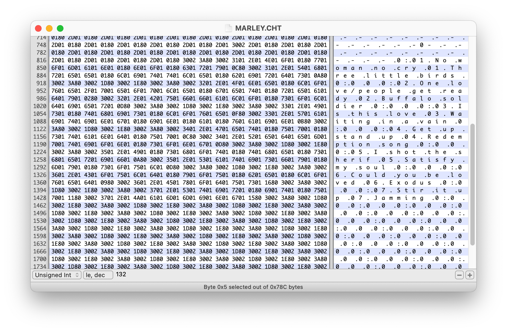

# Mysterious .CHT and .IMG files from the early 1990s

Hacker News user twooclock posted [Help HN: Can't Open Childhood Files](https://news.ycombinator.com/item?id=30396042), writing:

> I found also some files with .CHT and .IMG extension which I can't find any software to open them.
> I know I made them, but unfortunately I can't remember which software was used. There is my family
> tree and chart of my height growing (which I'd like to compare now with my kids).

Ouch! I too have files saved (in absolutely perfect [XKCD form](https://xkcd.com/1360/), in `~/Documents/Archive/Documents/Backup drive/backup/hdrive/archives`) that date back nearly as far.

People suggested ideas, some sensible some less so. You could get pretty far with a hex viewer: there was obvious ASCII-like text embedded in the files.

My [first suggestion](https://news.ycombinator.com/threads?id=awhitby#30398099) was that it might have been similar to the format of a printer, but that quickly proved a dead end. Even by the mid-1980s basically all printers used Epson-like encoding with ESC to indicate control characters. But these files had no ESC characters.

Sadly, the thread quickly sank, but I couldn't let it go. After a few hours the overall structure was pretty clear. But this program used some clever tricks to render different fonts and symbols, and to do that in Python was quite a bit more work. Still, it was worth it I think.

It sounds like twooclock has other files in this format, so if they don't render 100% correctly with my notebook, I can probably use them to fill in some of the gaps in my decoder / renderer.

You can view the notebook with the code and renderings of all four files [here on github](hn_mystery_files.ipynb) or [run it without installing anything locally](https://mybinder.org/v2/gh/econandrew/hn_mystery_files/HEAD?labpath=hn_mystery_files.ipynb) on the Alan Turing Institutes Binder service. To make the second half run, you'll have to uncomment and run the `!pip install pillow` command to install the `pillow` image library.
